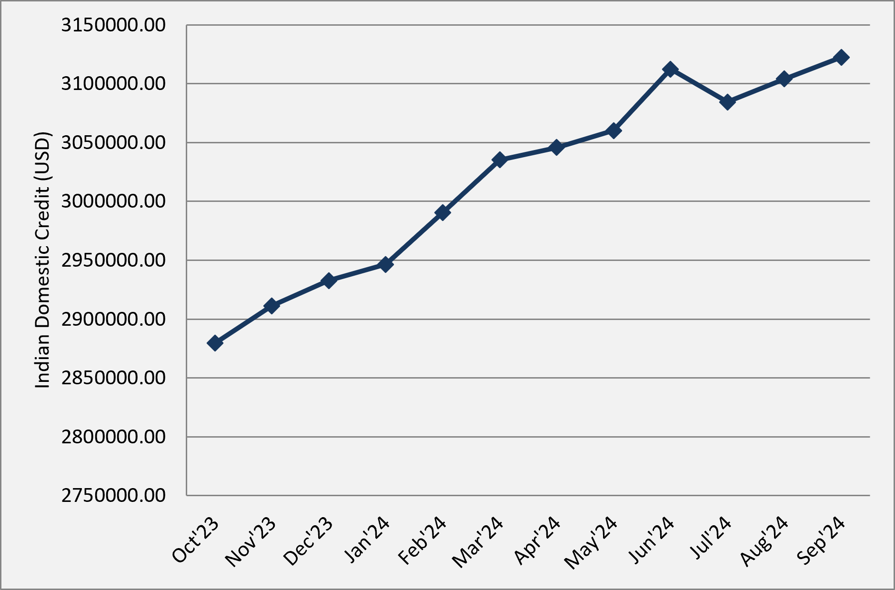
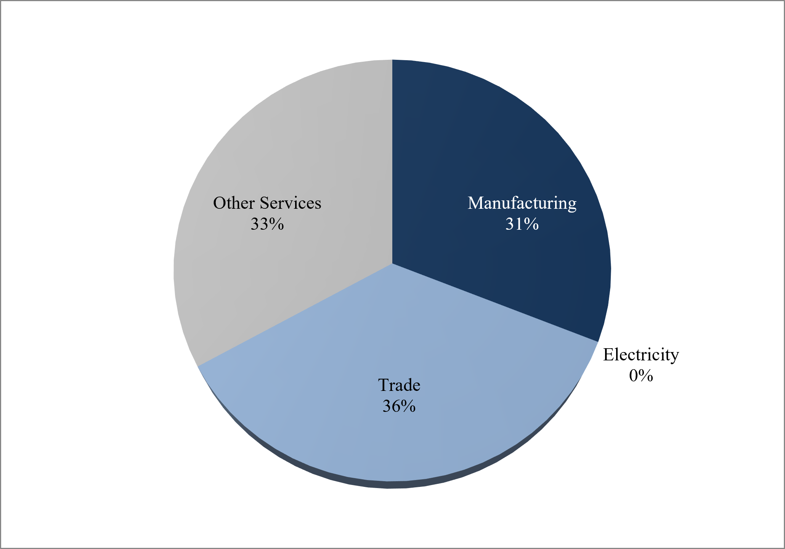
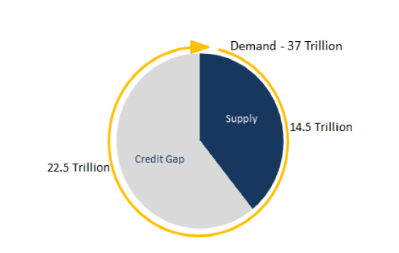
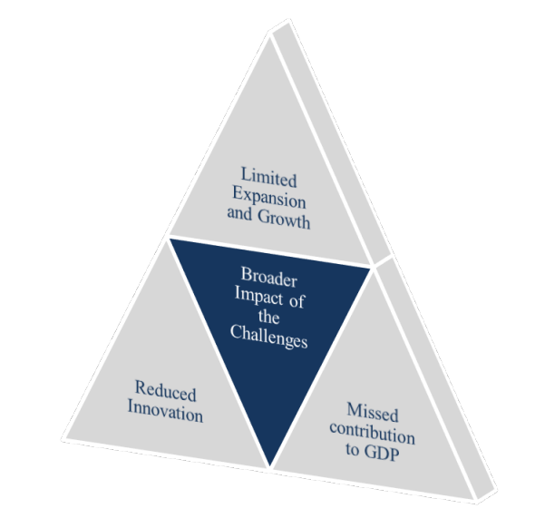
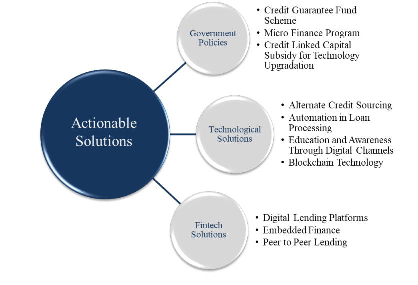
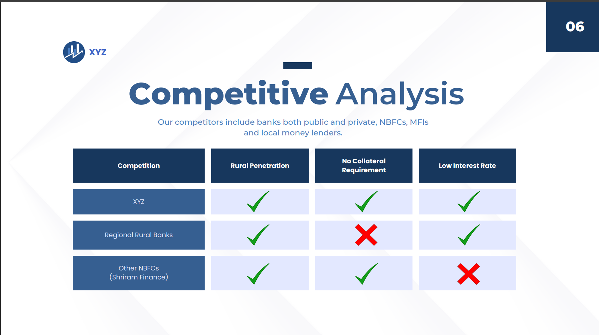
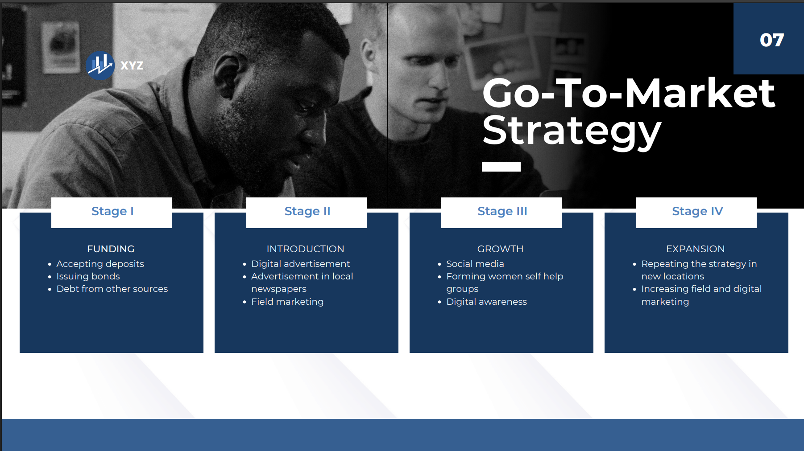

# Credit Catalyst: Unveiling India's Lending Landscape

Market-entry strategy and credit ecosystem analysis for rural MSME lending in India, with a focus on credit gaps, borrower challenges, financial inclusion and technology-led lending solutions.

## Overview

This project studies India's credit ecosystem through the lens of Micro, Small and Medium Enterprises (MSMEs), especially rural and trade sector MSMEs that face barriers in accessing formal credit. The work combines market research, data backed credit analysis and a proposed market entry plan for a lending and financial education solution.

The repository includes a research report, a market-entry plan, background research, source references and supporting data/charts.

## Key Research Questions

- How is India's credit market structured across individual, corporate and government borrowers?
- What role do MSMEs play in employment, GDP contribution, exports and innovation?
- Why do many MSMEs remain underserved by formal credit channels?
- What is the size and impact of India's MSME credit gap?
- Which policy, technology, and fintech interventions can improve credit access?
- How can a new entrant serve rural trade MSMEs through collateral free credit and financial education?

## Project Highlights

- India's domestic credit reached approximately USD 3.1 trillion in August 2024, with reported year-on-year growth of around 11%.
- MSMEs account for a major share of India's enterprise base and are especially important in rural employment and inclusive growth.
- Rural MSMEs and trade-sector enterprises remain attractive but underserved segments.
- Major credit barriers include lack of collateral, high interest rates, limited formal credit history, low financial literacy and information asymmetry.
- The MSME credit gap is estimated in the tens of trillions of rupees, with major demand from working capital and capex requirements.
- The proposed solution combines collateral-free lending for trade MSMEs with digital financial education.


## Research Report

The main report, `ICG Report Vedika Yadav.pdf`, is organized into five sections:

1. The Indian Credit Market
2. MSMEs in the Credit Ecosystem
3. Challenges Faced by MSMEs
4. Broader Impact of the Challenges
5. Actionable Solutions

### Indian Credit Market

The report describes India's credit market as a diverse ecosystem serving individuals, corporations, MSMEs and government borrowers. It covers banks, NBFCs, MFIs, venture capital, private equity, P2P lending, government schemes and informal lenders.




### MSMEs in the Credit Ecosystem

MSMEs are highlighted as a core driver of employment, exports, GDP contribution, rural enterprise activity and innovation. The report also distinguishes micro, small, and medium enterprises based on investment and turnover thresholds.




### Challenges Faced by MSMEs

The report identifies several constraints that limit MSME access to formal credit:



### Broader Impact

The MSME credit gap affects more than individual businesses. It limits enterprise growth, job creation, technology adoption, working capital availability, innovation and GDP contribution.



### Actionable Solutions

The report proposes a multi-layered response involving public policy, technology, and fintech innovation.


## Market Entry Plan

The market-entry plan proposes a lending and education platform for rural trade MSMEs.

### Target Segment

The proposed target market is rural and backward-area MSMEs in the trade sector. The opportunity is supported by three observations:

- MSMEs account for a large share of businesses.
- A significant portion of MSMEs are rural enterprises.
- Trade-sector MSMEs form a meaningful part of the MSME base.

### Proposed Offering

The solution has two parts:

1. Collateral-free loans for trade MSMEs based on previous sales and GST filings.
2. Financial education for MSME owners through digital channels such as YouTube and Instagram.

### Competitive Positioning

The competitor set includes public and private banks, regional rural banks, NBFCs, MFIs, and local moneylenders. The proposed positioning focuses on:

- Rural penetration
- Collateral-free lending
- Lower interest rates
- Digital education support




### Go-To-Market Strategy

The plan outlines a four-stage go-to-market approach:




## Data and Charts

The Excel workbook `Data and Charts.xlsx` contains supporting data and charts for the report and market entry presentation deck.


## Files

| File | Description |
| --- | --- |
| `reports/ICG Report Vedika Yadav.pdf` | Full research report on India's credit market and MSME lending landscape |
| `reports/ICG Credit Catalyst Vedika Yadav Market Entry Plan.pdf` | Market-entry plan for a rural MSME credit solution |
| `docs/Background Research.pdf` | Background research on credit catalysts and India's lending environment |
| `docs/Bibliography.pdf` | Source list and research notes |
| `data/Data and Charts.xlsx` | Supporting data tables and charts |

## Repository Structure

```text
.
├── README.md
├── data/
│   └── Data and Charts.xlsx
├── docs/
│   ├── Background Research.pdf
│   └── Bibliography.pdf
├── reports/
│   ├── ICG Report Vedika Yadav.pdf
│   └── ICG Credit Catalyst Vedika Yadav Market Entry Plan.pdf
└── images/
    └── charts/
        ├── domestic-credit-trend.png
        ├── credit-growth-comparison.png
        ├── msme-sector-distribution.png
        ├── msme-credit-gap.png
        └── go-to-market-strategy.png

```


## Author

**Vedika Yadav**  
Project: ICG - IITK Winter Project, 2024
